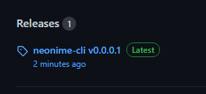
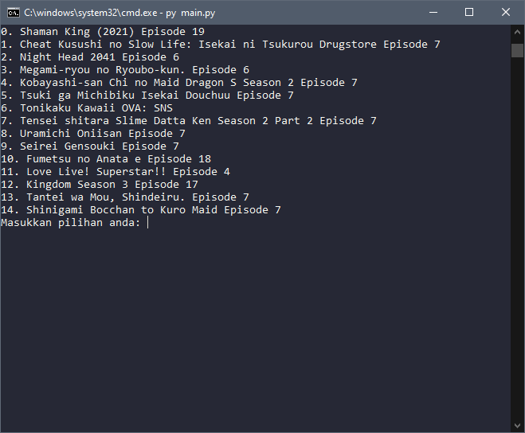
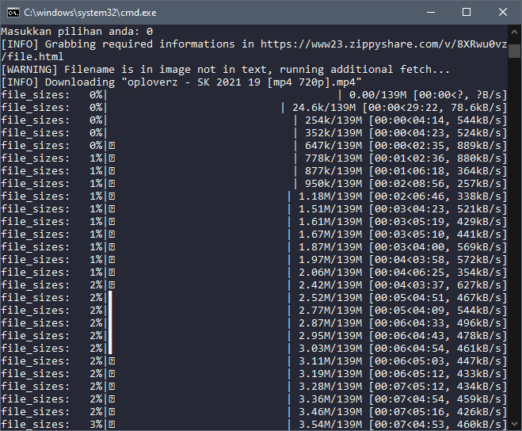
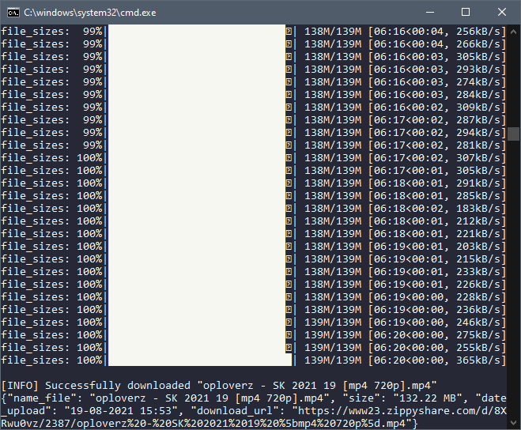

# neonime-cli
script untuk mendownload anime dari neonime 
## instalasi
yang pertama dan paling utama adalah mendownload python
silahkan download python pada link dibawah

[python 3.7 64bit](https://www.python.org/ftp/python/3.7.9/python-3.7.9-amd64.exe)

[python 3.7 32bit](https://www.python.org/ftp/python/3.7.9/python-3.7.9.exe)

## download

klik bagian release



atau kalian bisa clone repository ini

masuk ke dalam foldernya, jangan lupa untuk jalankan ```pip install -r requirements.txt ```

setelah itu tinggal jalanin ```python main.py ```

output dari anime akan berada pada folder Anime/

## penggunaan



pilih nomor dari anime yang ingin di download






